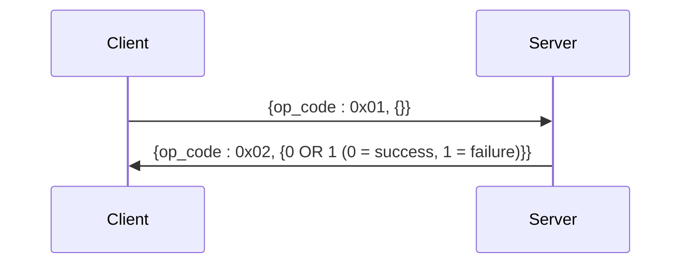
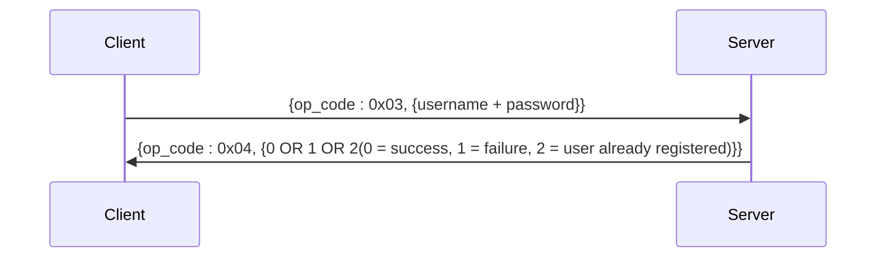
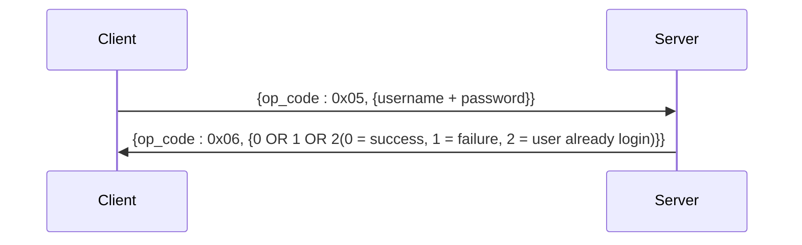
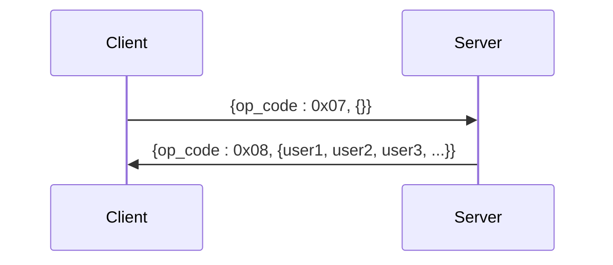
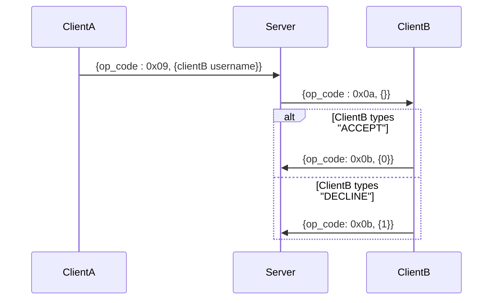
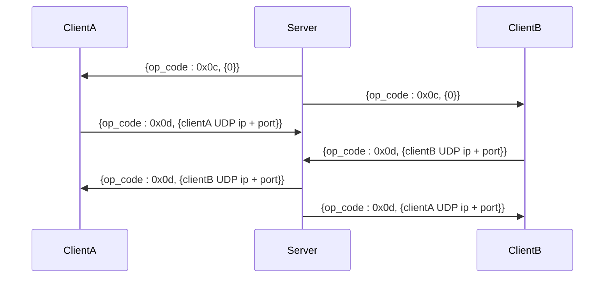
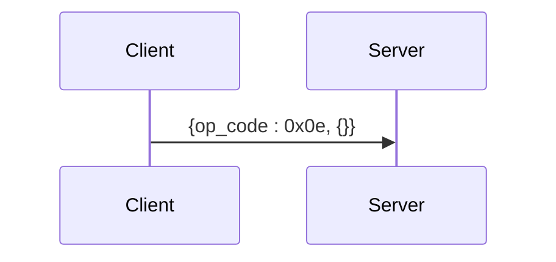

# **TCP PROTOCOL** : Networking flow

## 1. Packets structure

### Header

The packet header is composed of :  
- an **op_code** (uint8_t = 1 byte) : 0x01 -> 0x0e
- the **body size** (uint16_t = 2 bytes), which correpsond to the variable length of the following body

### Body

- Type: std::vector<uint8_t>
- Content: The body is a raw byte stream. While the protocol is binary, the payload contains either integers for multiple-state response or binary infos such as ip and port sharing.

## 2. Networking flow

### 2.1. Server connexion ("CONNECT" cmd)

### 2.2. User Registration ("REGISTER" cmd)

### 2.3. User Login ("LOGIN" cmd)

### 2.4. User listing ("USERS" cmd)

### 2.5. Calling user ("CALL" cmd)

### 2.6. Call process

### 2.7. END_CALL

