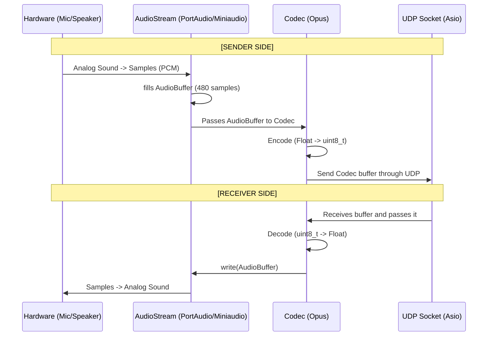

# **UDP PROTOCOL**

## 1. AudioBuffer Packet structure

- samples (float vector): 480 samples for a 10ms audio
- sample rate (Integer): set by default at 48000hz for resolution
- channel (Integer 1 or 2): Mono/Stereo channel

## 2. Packet life-cycle

